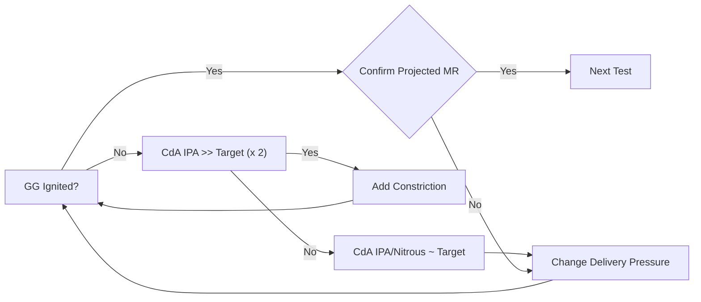
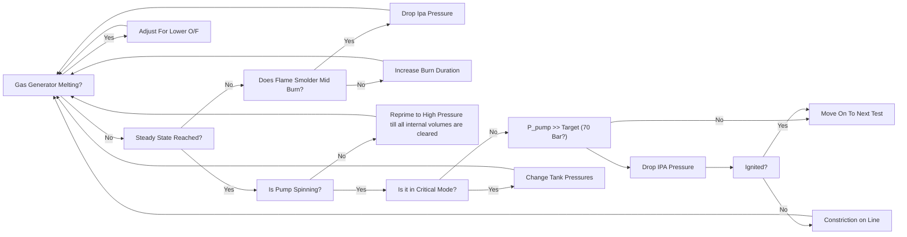
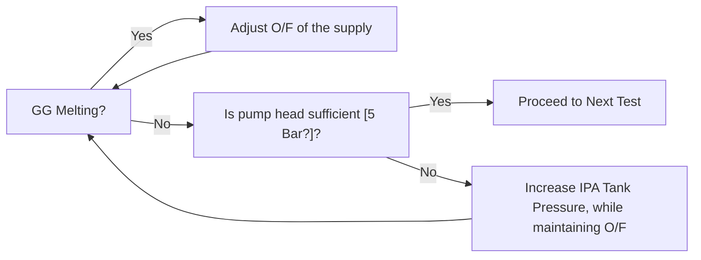
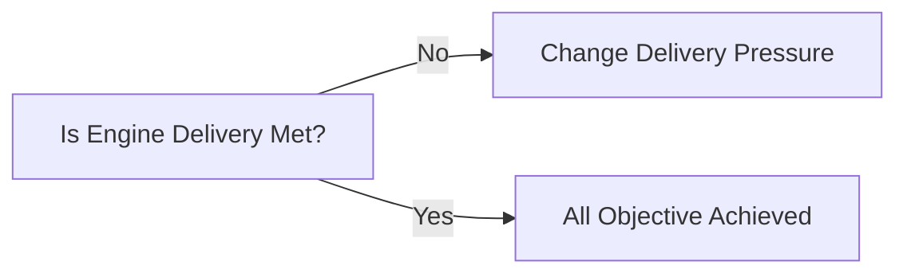

# Test Plan and Matricies

## 1 - Background

This document contains the test plan and matricies for the turbopump testings.

## 2 - Development Logic

### 2.1 - Target Description

- Turbopump provides 50 Bar Outlet IPA, at a flow rate acceptable for SF3 @ nominal performance.
- Turbopump will have a pressure rise of 25 Bar across its inlet and outlet.
- Turbopump will be capable of running for 5 seconds while maintaining stable pressure head.

### 2.2 - Test Logic

Here we list the tests we perform to achieve the targets previouslt described.

**GG_IGN**:
- Aim: Ignition of the gas generator.
- Description: 1s Trim Burns to confirm Gas Generator
- Targets:
  - Succesful Igntion for 1 second run.
- Parameter:
  - IPA Rig Delivery: []
  - N20 Rig Delivery: 
  - Ignition Timings:

**TBP_TRANSIENT**:
- Aim: Trasient characterisation of the turbopump
- Description: Back to back turns slowly increasing the duration.
- Target:
  - Reaching Steady State
  - O/F of 1 target achieved
  - No significant signs of melting of GG
- Parameter:
  - Duration: [2 - 10 ] s
- Criteria:
  - Stable Pressure: Operators Judgement

**GG_FLB**
- Aim: Prove that the Gas Generator Can Survive and Maintain the full duration of the burn
- Description: Qualification Burn before main engine hotfire [10 ] s Duration
- Target:
  - Survives it with no burn throughs.
- Criteria:
  - Operators Judgement

**ENGINE_FIRE**:
- Aim: Full Stack test for the engine and gas generator to demonstrate they can operate in a coupled format.
- Description: Fire both Turbopump to spin up then fire main engine then see what happens.
- Target:
  - Everything works.
- Critiera:
  - Everything works.

## 3 - Decision Matrix

Here we make the decision matrix for the many faults that can happen in the system.

### 3.1 - GG_IGN

### 3.2 - TBP TRANSIENT

### 3.3 - GG_FLB

### 3.4 - ENGINE_FIRE

## 4 - Test Sequence for the Day

### 4.1 - Main Valve Functional Check

1. Actuate main IPA valve three times, visual inspection to confirm functionality.
2. Actuate main N20 valve three times, visual inpsection to confirm funtionality.

### 4.2 - Priming

1. Supply IPA at low pressure [1 Bar] to slowly fill the pump up with fluid while main valve open.
2. Aim to get regen jacket full of SF3.
3. Close Main Valve IPA.
4. 5 min wait post priming to allow for evaproation of propellant in GG/SF3.

After that, straight into development logic.

## 5 - Red Line Decisions

### 5.1 - Overpressure Criteria

We will just specify a fixed overpressure criteria based on the rating of our components. In this case, to maintain margin, the following redline is selected.

**Red Line Crtieria**:
- 75 Bar

### 5.2 - Propellant Temperature

As the Pump spins up, it will heat up the propellant as you are dumpting the energy to a small volume of IPA.

**Red Line Crtieria**:
- 60 C

## 6 - Failure Stop Conditions

This section is a list of points when the test house should stop testing immediately.

- Any damage to SF3
- Any signficant sparks to GG.
- Significant Red Hot Spots on Turbine Stator